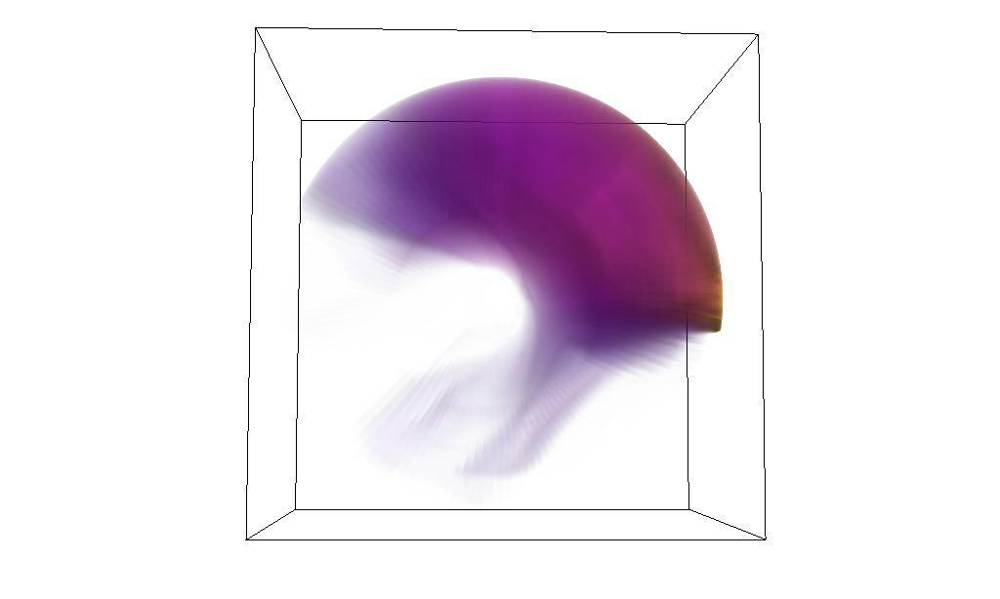
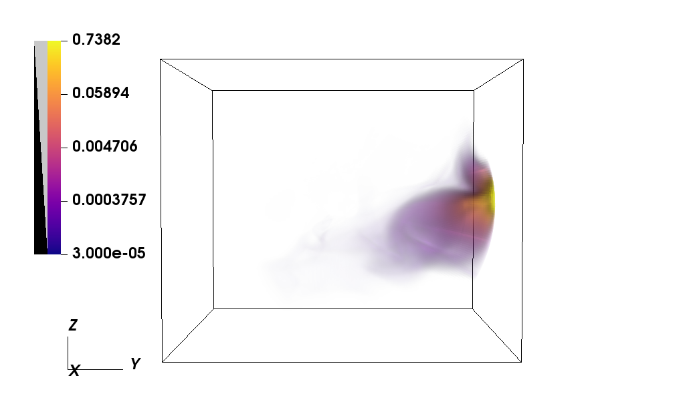
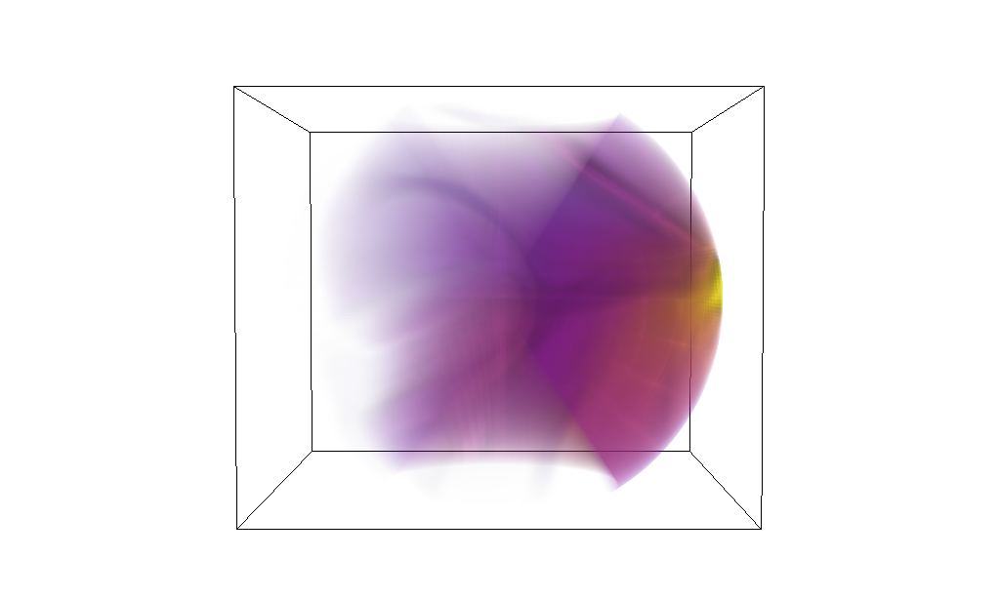

When running an accretion disk simulation for a long time, there's one problem that is unavoidable: mass loss in the disk.

The main function of an accretion disk is to move material in towards the black hole (or other compact object), where it can ultimately leave the flow and be accreted. But this simple nature of accretion disks means that mass is continually being lost at the innermost radius. Left untreated, this will ultimately spell the end of your disk's life. But what of the period before this, when the total mass is still decreasing but not yet zero? Previous studies such as those done by [Narayan et al. (2012)](https://academic.oup.com/mnras/article/426/4/3241/1017567) found a secular decrease in the mass accretion rate $\dot{M}$ at late times, possibly due to the overall decrease of mass in the disk. The mass accretion rate is an important metric, amongst others, because it can signify the kind of accretion flow that is present. Thin disks often accrete at very high rates, near the Eddington rate, while thicker disks (e.g. ADAFs) accrete at lower rates. Accretion may also be increased or decreased due to specific configurations of the magnetic field in the inner region. If the disk is not feed and the mass accretion rate slows at late times due to decreased disk mass then it prevents us from properly studying the behaviour of our simulations at these late times.

To solve this problem, long-timescale disks are generally fed by one of two methods:

1. Injection through a nozzle/stream
2. A large, low-resolution reservoir of mass at higher radius

Option 2 is computationally the easiest, but comes with the disadvantage of being finite; that is, it only delays the problem, it doesn't solve it. Option 1, on the other hand, can continuously add mass and won't be depleted, however it tends to create spiral shocks and waves in the disk and may amplify instabilities that otherwise wouldn't be present (e.g. [Ju et al. 2016](https://iopscience.iop.org/article/10.3847/0004-637X/823/2/81), [Bowen et al. 2018](https://iopscience.iop.org/article/10.3847/2041-8213/aaa756), [2019](https://iopscience.iop.org/article/10.3847/1538-4357/ab2453)). Setting a resolution is more challenging when implementing a nozzle: spherical polar coordinates naturally mean less resolution at larger radius, but this is where the nozzle is located. There is an additional challenge in setting the magnetic field for such a nozzle as it must be divergence free.

As a side project to my PhD, I have been looking at how to set up an inflow nozzle, both for an established disk and for an empty simulation field with the view of building up a disk from nothing. Setting the inflow rate is not a major concern as my simulations are designed to be scale free, and so the disk accretion will naturally settle over time into an stable state to match the inflow of mass.

If I am able to construct a stable disk from nozzle material alone then it could provide a useful comparison point to my main PhD project, which involves initialising a disk near equilibrium.

Below are some very preliminary images of what the build looks like. The black hole is located at the very centre of the cube, although it, and the region around it, are not shown. The top row shows the disk when looking down from above, with the nozzle located on the right. The bottom row shows the same disk when viewed from the side. The left hand side is at a very early time while the right hand side shows the same disk sometime later.

