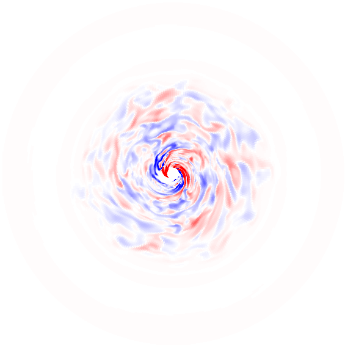
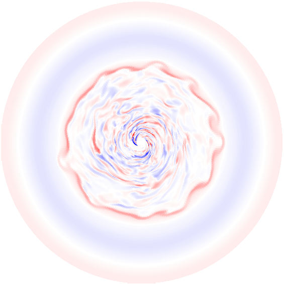
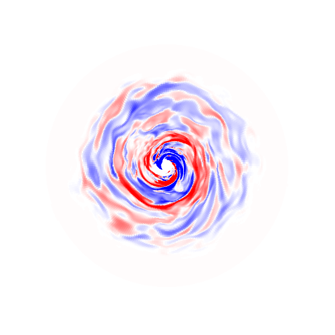

The basic physics is rather well-understood: the Navier-Stokes equations describing fluid motions, combined with Maxwell's equations for electromagnetism to form the theoretical framework known as magnetohydrodynamics (MHD). The details beyond this point are rather like crossing t's and dotting i's, or at least it can seem that way.

#### History time

The study of accretion disks is one defined by its limitations.

Given the intense light that's emitted near the centre of a galaxy and the tiny size of an accretion disk relative to that galaxy, it's no surprise that we are yet to image an accretion disk to a reasonable resolution. As of 2019 we do now have the image of M87\* from the Event Horizon Telescope [(The Event Horizon Telescope Collaboration et al. 2019)](https://iopscience.iop.org/article/10.3847/2041-8213/ab0ec7), but even here, the beam size of the telescope (~pixel size in the image) is roughly equal to the width of the illuminated ring. That is, all of the information available in the disk is contained within a single pixel. Some of the larger features of the image can be used to verify broad concepts like General Relativity, but any finer details will have to wait for the next major advancements in observational technology and techniques.

Because of this lack of high-resolution observation, much of the history of accretion disk studies has been a theoretical and computational exercise. Seminal works by [Shakura & Sunyaev (1973)](https://ui.adsabs.harvard.edu/abs/1973A%26A....24..337S/abstract) and [Lyden-Bell & Pringle (1974)](https://academic.oup.com/mnras/article/168/3/603/990948) (among others!) in the 70's recognised that magnetic fields were likely to be important for the evolution of disks, but being limited to the (non-existent) computational resources of the time, they restricted themselves mostly to hydrodynamical studies and worked in, at most, 2 spatial dimensions. Anything more complex was mathematically intractable. It wasn't until 1991 that [Balbus & Hawley](https://ui.adsabs.harvard.edu/abs/1991ApJ...376..214B/abstract) connected the earlier work of [Velikhov (1959)](http://www.jetp.ac.ru/cgi-bin/e/index/e/9/5/p995?a=list), [Chandrasekhar (1960)](https://www.pnas.org/content/46/2/253), and [Fricke (1969)](https://ui.adsabs.harvard.edu/abs/1969A%26A.....1..388F/abstract) to accretion disks and showed that disks are vulnerable to a form of magnetic instability now known as the magnetorotational instability (MRI).

Since 1991, the name of the game has been magnetic fields. 

