### How much does it matter?

It can matter quite a lot, anywhere between "a sizeable bonus" to "required for entry". Much of the assessment of your application is trying to answer one key question: is this person going to succeed in a PhD? As a PhD is a higher degree by _research_, one very clear way to show your potential as a researcher is to already have some experience in research. There is no better proof of your potential than a published paper or a letter from a research supervisor directly stating your skill.

It's also very important from a more personal point of view: you may not enjoy research. Doing research is not at all like taking classes, and just because you loved and excelled in the latter doesn't mean you'll love or excel in the former. Getting research experience as an undergraduate is a good opportunity to dip your toes in and to try out some different fields without the commitment of a 3-10+ year PhD. Personally, I think this experience is also very important when it comes to finding programs and supervisors, and for adjusting to a PhD. If you know what work environment and mentorship style you like best then you can target these qualities in your program search. It also gives you more power at the start of a PhD when you sit down with your new supervisor to discuss expectations.

However, I do realise that research experience can be very hard to get. 

Many countries do not have a culture of letting undergraduates do research, and so there may be few or no opportunities nearby while other countries limit their opportunities to citizens and permanent residents. Don't despair too much as admissions committees should know the context of your country, but you should also reach out to someone in graduate admissions and ask. They may suggest you do a Masters degree first.

In other cases, there might be opportunities around but they're all extremely competitive. Here, it's good to widen your search as much as possible. Many people will Google "undergraduate research opportunities" and see only advertised research _programs_. These are great, but you can also email researchers at basically any university and ask to intern under them for a summer. Rather than apply to a pre-existing post, in this situation you're _creating your own opportunity_. You can use this experience to help you apply for those uber-competitive research experience programs, or you can keep emailing and working in different groups.

Or, there may be plenty of opportunities and you may even have some offers, but they don't pay or aren't accessible. This is an incredibly unfair situation and it's one of the many ways that academia shuts out low-income, disabled, and disadvantaged students. You should certainly ask whether pay or some kind of financial assistance (e.g. a rent subsidy) is possible. Alternatively, you can look for specific programs aimed to help students from disadvantaged backgrounds like the [Fisk-Vanderbilt bridge program](https://www.fisk-vanderbilt-bridge.org/program). You can also find outside funding from various fellowships and scholarships (here's a link for [POC](https://docs.google.com/spreadsheets/d/1V_pvhqWliwqLhAVcXikxAEuJPD4mwwgl9LEgOnzN-zM/)). If all else fails, you might be able to find a paid internship in a closely aligned industry. Undergraduate research internships _should_ pay their interns enough to afford rent and living expenses in the area where they're interning. Remember this challenge when you become a PhD student or permanent research staff, and then pressure your institution to provide adequate pay to its interns. Give to the next generation what you never had: an opportunity.

### How do I find groups to join?

Let's walk you through it! As an example, let's say we're an undergraduate student in physics who'd like to do research in theoretical condensed matter physics.

Your first port-of-call should be the homepage for the department of interest. You can tell that you've hit a department page because the style will typically be more outdated. While the university homepage is sleek and all curves, the department homepage may be more reminiscent of Windows 98 — all edges.




You can also tell by the web address. For Harvard university general it is `www.harvard.edu`, while the physics homepage is `www.physics.harvard.edu`.

Once here, we want to check out the research that they do at this university, so head over to the research tab. In this case, Harvard very usefully provides an option to check out "Faculty by research area", so we'll head there. If this option isn't available then you can typically navigate to the research directory and find lists of affiliated researchers under the different topic banners anyway, or you can head to the "Faculty" or "People" page and check fields individually.

Under Harvard's "Faculty by research area" page, we're faced with a list of subject areas and the names of academics who do research in those areas. We're interested in theoretical condensed matter physics, so we look in the area I've highlighted. If we click on the first person in this list then we're taken to an individual researcher's page; in this case, Eugene Demler, who is a Professor of physics. On this page, Prof. Demler describes his main research interests and his motivations for researching them. There are links to his personal webpage and that of his wider research group. There is also contact information, including an email address. 




Sometimes these faculty pages will have links to an academic's published papers, but in this case we need to head to Prof. Demler's personal webpage and/or the group webpage. You should do this and try to skim read any recent papers or project summaries. Does this look like research you'd be interested in?

Also be sure to check the CV of potential supervisors and be on the look-out for a section about mentoring, where they list students (from undergraduate to PhD) who they've supervised. You might want to contact a previous student to ask them what that person was like as a supervisor.

Once you've checked these things and are satisfied that it's someone you would like to work with, send them an email and ask!

### How do I email them?

There are 3 basic rules you must follow:

1. Keep it short.

2. State your questions/intentions clearly.

3. Use proper etiquette. 

#### 1. Keep it short.

Researchers in general, and Professors in particular, are a busy bunch. They often have many things vying for their attention and it's not unheard of for a senior Professor to receive literally hundreds of emails **every single day**. A long email takes a long time to read and an even longer time to reply to, so if your email is too long, the reader may put it off indefinitely before ultimately forgetting it exists, or just ignore it. As a very rough rule, you should try to keep it at or below ~200-300 words, which is a couple of short paragraphs. This is plenty of space to introduce yourself, state your reason for contacting them, and enquire about research opportunities. If you want an example of an email, you can check out what I wrote to prospective PhD supervisors, but note that you probably won't have research experience yet so your email should be even shorter than mine!

#### 2. State your questions/intentions clearly.

Related to the above, it should be obvious what you're emailing about. The header/title/subject line of your email should clearly state the actual subject of the email, e.g. 

> "Enquiring about undergraduate research opportunities"

The first 2-3 sentences should be your introduction, e.g. 

> "My name is Jane Doe and I'm a 2nd year undergraduate physics student at Auburn University, AL."

and give the reason for your email, e.g. 

> "I'm looking for undergraduate research opportunties over the 2020 summer."

You can then give more detail. Tell them what research of theirs you're interested in. If you read one of their papers or a project summary on their personal webpage and would like to do a project in that area, say that. Show them that you've done your research and have the skills necessary to jump in to research. The main qualities people look for are curiosity, a quickness to learn, and hard work.

#### 3. Use proper etiquette.

This one trips up many undergraduates and it's an unfortunate mistake because it usually has **no** relationship to your manners, intent, or seriousness about the opportunity. It's simply a matter of niche cultural expectations.

Make sure to open and close your emails properly. An easy formal opening is 

> "Dear Dr. Smith"

while for closing you may want to use something like

> "Regards, Jane"

> "Kind regards, Jane"

In Australia we have a decidedly more laid-back attitude and so I usually go with "Cheers, Payton" for my closing. But this is a distinctly Australian trait, and if you use it in email to a non-Australian, it is usually too informal and can be considered offensive (I say this in warning to fellow Aussies!). This is because Australia's system of respect is largely reversed.

The most important thing is that you use the person's proper **title**. What this proper title _is_ can be confusing because it depends on job title, the highest degree held by the person, and the culture of academia in the country the person resides in or was trained/taught in. Below are some typical job titles in different countries (Australia, the US, and the UK), but it varies a bit even between universities in the same country. This can make it very confusing to figure out the appropriate form of address!

```mermaid
graph TD;
  subgraph Australia
  A(PhD)-->B(Postdoctoral);
  B(Postdoctoral)-->C(Lecturer);
  C(Lecturer)-->D(Senior Lecturer);
  D(Senior Lecturer)-->E(Associate Professor);
  E(Associate Professor)-->F(Professor);
  classDef website fill:#e8c8c7,stroke:#9d1512,stroke-width:2px
  class A,B,C,D,E,F website
  end
  style Australia fill:none,stroke:none
  subgraph US
  AA(PhD)-->BB(Postdoctoral);
  BB(Postdoctoral)-->CC(Assistant Professor);
  CC(Assistant Professor)-->DD(Associate Professor);
  DD(Associate Professor)-->EE(Professor);
  EE(Professor)-->FF(Distinguished Prof.);
  classDef website fill:#e8c8c7,stroke:#9d1512,stroke-width:2px
  class AA,BB,CC,DD,EE,FF website
  end
  style US fill:none,stroke:none
  subgraph UK
  AAA(PhD)-->BBB(Postdoctoral);
  BBB(Postdoctoral)-->CCC(Lecturer);
  CCC(Lecturer)-->DDD(Senior lecturer);
  DDD(Senior lecturer)-->EEE(Reader);
  EEE(Reader)-->FFF(Professor);
  classDef website fill:#e8c8c7,stroke:#9d1512,stroke-width:2px
  class AAA,BBB,CCC,DDD,EEE,FFF website
  end
  style UK fill:none,stroke:none
```

In the US, you may refer to all teaching staff at a university by the title Professor, which can be shortened to Prof., regardless of whether that person holds a PhD or not. When someone does hold a PhD then you can refer to them as Dr. You are unlikely to offend if you get it wrong between these two because neither one is inherently "better" than the other, and people with doctorates often ask to be referred to as Prof.

In many other countries, the Professor title is reserved for those whose _job title_ is that of a Professor as it is a distinguished group and considered a higher position than Dr. You _may_ offend if you get this wrong, particularly if you use Dr (a lower title) where you should have used Prof., but offense should be rare and if someone is truly offended at this mistake then you probably don't want to intern under them anyway.

**Do not use Mr/Mrs/Ms/Miss/Sir/Madam/Mx**. Firstly, you're almost certainly emailing someone who holds a PhD and so the honorific should be Dr in recognition of that. Secondly, almost all options (Mr/Mrs/Ms/Miss/Sir/Madam) are inherently gendered, and for women many common options are based on marital status (Mrs/Miss). Both of these things are personal and you should not assume them based on perceived gender or age. For women in particular, where you are often less well-respected than your male colleagues by default, being referred to as Miss or Mrs can be incredibly offensive. Don't do it. If someone wants to be referred to using one of the above titles, or by their first name or a nickname, they will ask you to do so. When in doubt, use the higher title (e.g. Dr or Prof) and allow the person to correct you if they would prefer Mr, Ms, or Mx.

### Is it better to stay with one group for a long time or to work with multiple groups for short periods?

This is up to you!

If you stay in one group for a long time then you maximise your expertise in that area and have a greater chance of finding your way onto a publication as an author.

If you do multiple short projects then you can try your hand in a few different areas with different supervisors and really figure out what you want to do and how you work best, which is much harder if the sum of your experience is based on n=1. With multiple supervisors you will also have more people to write letters of recommendation for graduate applications.

I did multiple short projects and greatly enjoyed it! I also benefitted hugely from the range of experiences in both theory and observation (experiment), and although I am now in theory, my observational experience still helps me to put my theory into context and to predict what observers should see based on my work.

### What about other extracurricular activities (ECs)? It is useful to work as a tutor? Should I be a teaching assistant (TA)?

These are generally not as important as either grades or research. You may be expected to work for the university as a tutor or TA during your PhD and so you might want to get some experience in these things, but it's not likely to be a huge plus on an application. You can ceertainly do these things if you enjoy them and/or want to earn some money, but take care not to let your grades or research dip.

There are some scholarships (e.g. Rhodes and Gates Cambridge) that pretty much require community work and significant ECs, but these are the minority and the most appropriate activities in that case will be informed by your specific field.

You should continue on with hobbies that you enjoy, just don't expect them to contribute to your PhD applications.
